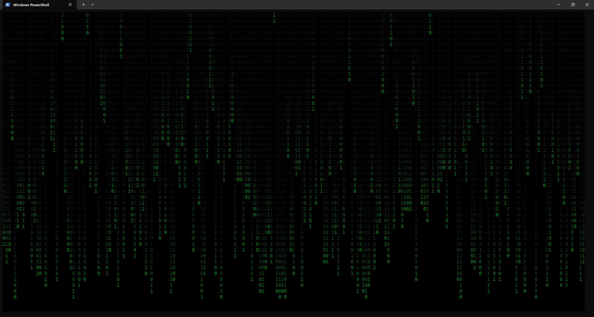
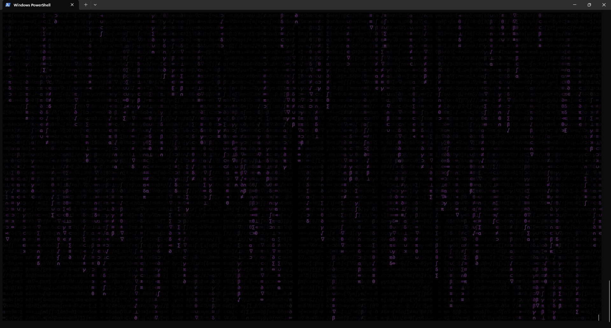
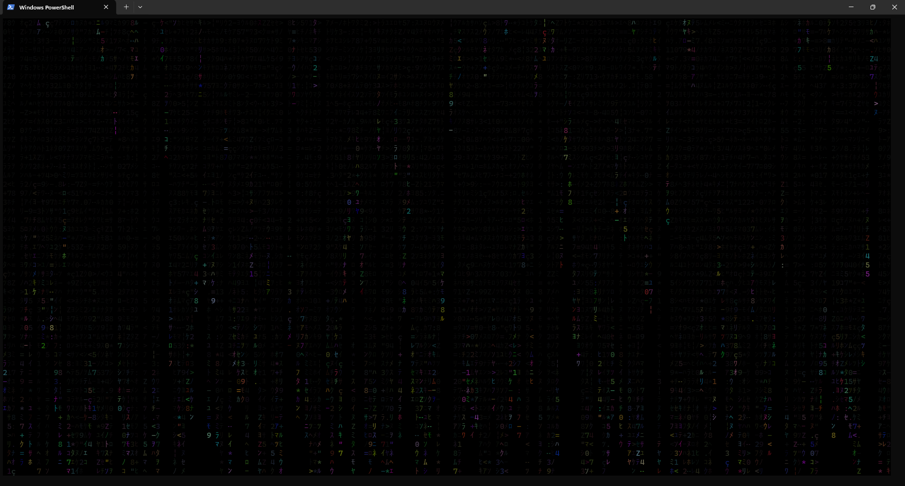

# Rustrix

[]()
[](https://www.rust-lang.org/)
[](https://opensource.org/licenses/MIT)

> 🚧 This project is under active development. Breaking changes may occur.

## Overview

Rustrix is a terminal-based animation project that simulates a "falling text" effect, inspired by scenes from the movie The Matrix.
Characters flow down the terminal screen in a randomized, visually dynamic manner.

## Screenshots

### bin



### random



### rainbow



## Purpose

This project was created to learn how to define and handle command-line arguments and implement smooth terminal animations using Rust.
Mastering CLI arguments has significantly benefited my other Rust projects by providing flexible runtime configurations.

## Features

- Control animation behavior via command-line arguments:
  - Text color
  - Language (character set)
  - Font size (character scaling)
  - Animation speed
  - Text density
  - Randomized character mode
  - Rainbow color mode
- Smooth terminal animations using crossterm
- Custom random number generator to control character appearance probabilities

## Technical Implementation

- Rust v1.86
- clap v4.5
- crossterm v0.28
- ctrlc v3.4
- rand v0.8

## Building from Source

```sh
cargo build --release
```

## Usage

### Help

```sh
target/release/rustrix --help
```

### Version

```sh
target/release/rustrix --version
```

### Select Language

```sh
target/release/rustrix -l bin
```

or

```sh
target/release/rustrix --language bin
```

### Set Text Color

```sh
target/release/rustrix -C red
```

or

```sh
target/release/rustrix --color red
```

### Enable Random Mode

```sh
target/release/rustrix -r
```

or

```sh
target/release/rustrix --random
```

### Enable Rainbow Color Mode

```sh
target/release/rustrix -R
```

pr

```sh
target/release/rustrix --rainbow
```

### Adjust Text Speed

```sh
target/release/rustrix -v slow
```

or

```sh
target/release/rustrix --velocity slow
```

### Adjust Text Density

```sh
target/release/rustrix -d 0.2
```

or

```sh
target/release/rustrix --density 0.2
```

## Future Development

- Create a WebGL-based version to run animations in browsers
- Develop a Firefox extension/theme featuring the animation

## License

MIT License

## Author

**itsakeyfut**

Feel free to contact me for collaboration or job opportunities.
